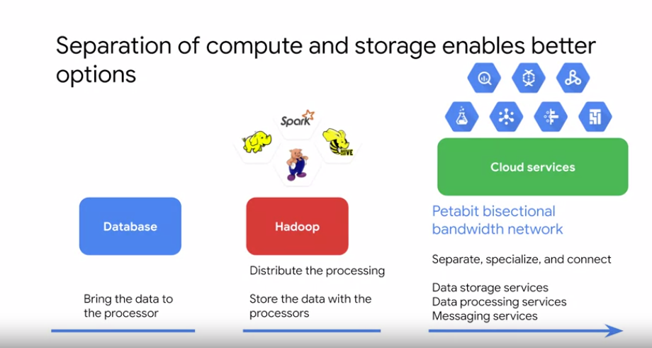

# 3 - Building Batch Data Pipelines on GCP

# Agenda

- EL, TL, ELT
- Executing Spark on Dataproc
- Leveraging CGP in Pipelines
- Serveless data processing with Dataflow

# EL, ELT, ETL

- EL → Extract & Load ⇒ Data already clean and correct | Data can be imported as it is
- ELT → Extract, Load & Transform ⇒ Data is transformed when its needed
- ETL → Extract, Transform & Load ⇒ Data needs transformation before its loaded

### Cloud Dataflow

- apache beam
- batch
- stream

### Cloud Dataproc

- Hadoop
- **Cloud Datafusion** ⇒ UI

### Data Quality Processing

1. Validity → data conforms to your business rules
2. Accuracy → data conforms to an objective true value
3. Completeness → create, save and stores datasets
4. Consistency → derives insights from data
5. Uniformity → explore and present data

# Executing Spark on Cloud Dataproc

Hadoop workloads on GCP

### Using Cloud Dataproc

- Setup → create cluster
- Configure → cluster, mater, workers, preeptible
- Optimize →
    - preemptible vms (lower cost)
    - custom machine types
    - minimum cpu platform
    - custom images
    - persistent ssd boot disk
    - attached gpu's
    - dataproc version
- Utilize → Submit job
    - console
    - gcloud command
    - rest API
    - orchestration services
        - dataproc workflow templates
        - cloud composer
- Monitor →
    - job driver output
    - logs
    - stackdriver monitor
    - cluster details graphs

## Optimizing Dataproc

Hadoop and Spark perfomance questions for all cluster architectures, Cloud Dataproc included

1. Where is you data, and where is your cluster?
2. Is your network traffic being funneled?
3. How many input files and Hadoop partitions are you trying to deal with?
4. Is the size of your persistent disk liminting you throughput?
5. Did you allocate enough virtual machines to your cluster?

## Optmizing Dataproc Storage

When local HDFS is necessary:

- your jobs require a lot of metadata operations— for exemple, you have thousands of partitions and directories, and each file size is relative small
- you modify the HDFS data frequently or you rename directories (cloud storage objects are immutable, so renaming a directory is an expensive operation because it consists of copying all objects to a new key and deleting them afterwards)
- you heavily use the append operation on the HDFS files
- you have workloads that involve heavy I/O. For example, you have a lo of partitioned writes, such as the following spartk.read.write.partitionBy(...).parquet("gs://")
- you have I/O workloads that are especially sensitve to latency. For exemple, you requier single-digit millisencond latency per storage operation

Re-sizing option for using local HDFS:

- Decrease the total size of the local HDFS by decreasing the size of primary persistent diskis for the master and workers
- Indrease the total size of the local HDFS by increasing the size of primary persisten disk workers
- Attach up to 8 SSDs (375 GB each) to each worker and use these disks for the HDFS
- Use SSD persistent disks for your master or workers as primary disk

### Optmizing Cloud Dataproc workflow templates

### Optmizing Dataproc Monitoring

Stack driver logging and performance monitoring ⇒ gcp console | gutil

## Cloud Data Fusion

Cloud Data Fusin is a fully-managed, cloud native, enterprise data integration service for quickly building and managing data pipelines

## Cloud Composer

- Orchestrate automatic workflows
- Apache Airflow
    - 0 to n dags
    - dag folder = gcs bucket
    - python files
    - operators
        - big query
        - cloud ml
        - etc
    - workflow scheduling
        - periodic
        - event driven
    - monitoring and logs
        - logs from airflow
        - gcp logs - stackdriver

## Cloud Dataflow

> Apache BEAM ⇒ Batch and Streaming Pipelines

[Choose between Dataflow and Dataproc](https://www.notion.so/6c7c7bfa4ae44914bd16bbea837846d2)

Dataflow Qulities:

- Scalabilty
- Low latency

[Serverless Data Analysis with Dataflow: MapReduce in Dataflow](https://www.notion.so/Serverless-Data-Analysis-with-Dataflow-MapReduce-in-Dataflow-86d40c39e9304d7e9fb38b20801ce94f)